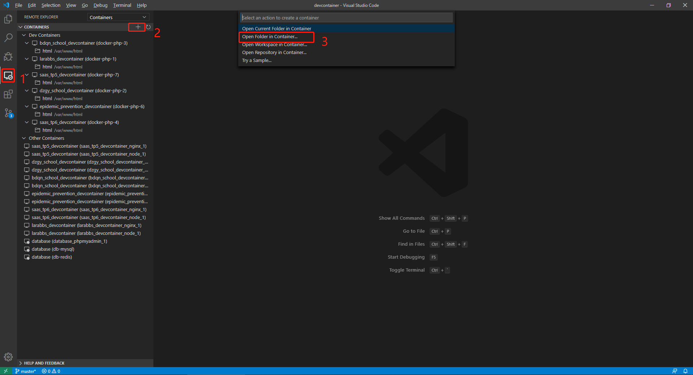

## 简介

本项目结合 VS Code 的 Remote - Containers 插件搭建 nginx、PHP 开发环境，使各个项目的 php 环境彻底隔离，每个项目可单独配置 php 和 nginx 版本。  
在搭建本项目前请先搭建 database 数据库项目并配置好 database_app 网络。

## 环境搭建

首先需要安装 Docker 如果是 windows 系统的话则是安装 docker for windows。
其次 vs Code 需要安装 remote-containers 插件。    
然后将本项目克隆至本地然后将开发项目代码放在 src 目录下，并将本项目下 .env.example 中的环境变量配置复制到 .env 文件中并配置值。

VSC_USERNAME #php环境运行用户和Git用户名
VSC_USER_EMAIL #Git的Email
CONTAINER_NAME #php实例名称

### 开始配置

配置好环境变量后，接下来配置 .devcontainer 的名称标识，修改 .devcontainer/devcontainer.json 文件中 name 配置项即可。    

nginx 配置，项目的 nginx 配置文件在 .devcontainer/nginx/conf.d/ 目录下的 default.conf 文件中。    
default.conf 文件可根据自己需求进行更改，默认更改 root 和 fastcgi_pass 配置项即可。    
root 配置到你项目需要解析的目录下。    
fastcgi_pass 配置为 你环境变量 CONTAINER_NAME 的值加 php 端口。   

>注意：CONTAINER_NAME 的值不能与现有的 docker 实例名称重复。

设置好以上的配置后就可以开始启动容器了。
首先打开 vs Code，然后如下操作。

然后选择本项目。  

最后等待项目启动。