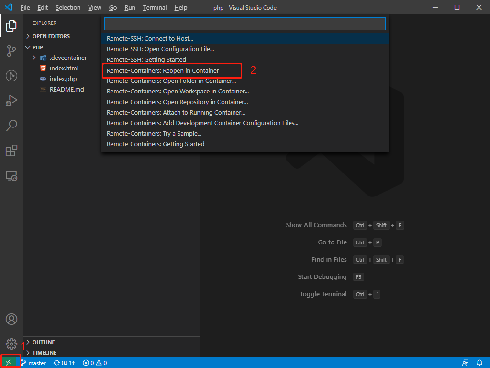

## 简介

本项目结合 VSCode 的 Remote - Containers 插件搭建 PHP 开发环境，安装应用有 PHP、Nginx、Node 和 yarn 默认安装版本如下。  

| 应用  | 版本                     |
| ----- | ------------------------ |
| PHP   | 7.4                      |
| Nginx | 1.18(默认安装最新稳定版) |
| Node  | 14.x                     |
| Yarn  | 1.22(默认安装最新稳定版) |

## 环境搭建

首先需要安装 Docker 如果是 windows 系统的话则是安装 docker for windows。  
其次 VSCode 需要安装 remote-containers 插件。  

### 开始使用

注意：该项目容器默认会添加到 database_app 网络，如果 database_app 网络不存在则会无法构建，解决方法如：  
1. 删除 `.devcontainer\devcontainer.json` 配置文件中 `runArgs` 配置项的 `--network=database_app` 即可。  
2. 添加 database_app 网络，添加命令 `docker network create database_app`。另可以部署一个数据库 [docker-database 项目](https://github.com/xueyong-q/docker-database.git)。  

nginx 配置，项目配置文件在 `.devcontainer/nginx/conf.d/` 目录下的 default.conf 文件中。nginx 的日志文件则在 `.devcontainer/nginx/log` 目录中。   

首先使用 VSCode 打开本项目，操作如下。  

然后选择在容器中重新打开。  

最后等待项目启动，项目启动后会将容器中的 80 端口映射到主机的 80 端口。  
如要修改端口映射，可以修改 `.devcontainer\devcontainer.json` 配置文件中 `appPort` 配置项。  
构建 Dockerfile 时的环境变量则在 `build.args` 中修改。  

另已安装的 xdebug 扩展默认的端口是 9001，如需修改端口则在 `.devcontainer/php/conf.d/xdebug.ini` 配置文件的 `xdebug.remote_port` 选项修改。  

## VSCode 扩展

| 扩展名称                   | 描述 |
| -------------------------- | ---- |
| PHP Intelephense           |      |
| PHP DocBlocker             |      |
| PHP Debug                  |      |
| Markdown All in One        |      |
| GitLens — Git supercharged |      |
| SQLTools                   |      |
| SQLTools MySQL/MariaDB     |      |